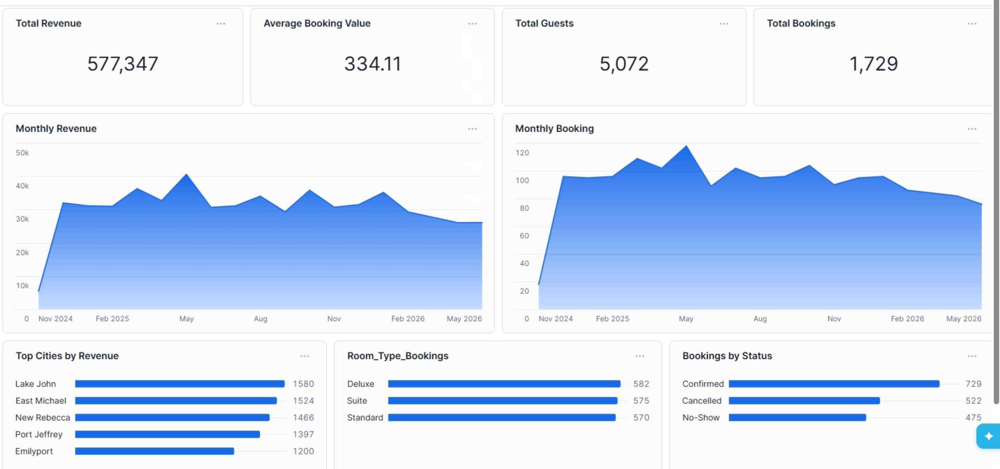

# Hotel Booking Data Pipeline (Snowflake)

This project builds an end-to-end data pipeline in **Snowflake** using the **medallion architecture (Bronze → Silver → Gold)**.  
The pipeline processes a hotel booking dataset and transforms raw data into **analytics-ready tables** for business insights.

## Tools
- Snowflake
- SQL

## Data Pipeline
Raw CSV → Snowflake Stage → Bronze → Silver → Gold → Dashboard

## Pipeline Layers

### Stage
Raw CSV data is uploaded into a **Snowflake stage** after defining the database and file format.

### Bronze
Raw data is loaded from the stage into a **bronze table** using `COPY INTO`.  
No transformations are applied at this stage.

### Silver
Data cleaning and validation are performed, including:
- Fixing incorrect booking status values
- Filtering invalid email formats
- Removing records where check-out date occurs before check-in date

### Gold
Business-ready tables are created for analytics, including:
- Monthly revenue
- Monthly booking count
- Top 5 cities by revenue
- Total revenue
- Total bookings
- Average revenue per booking
- Total number of customers

## Dashboard
The final metrics are visualized in **Snowsight** using SQL queries and built-in chart features.

